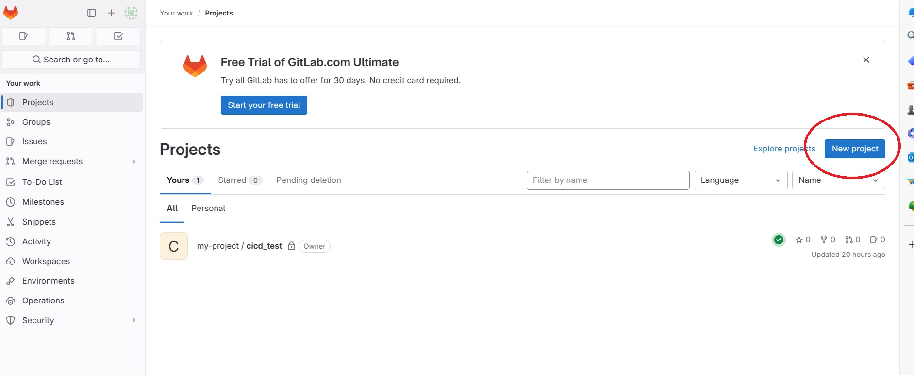
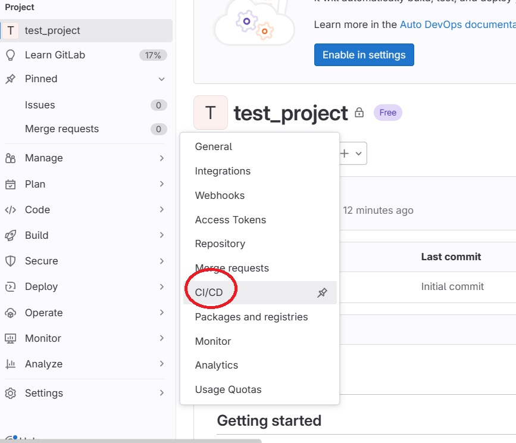
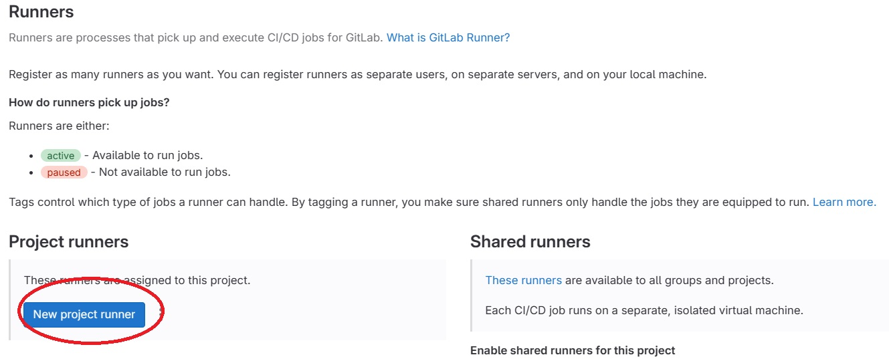
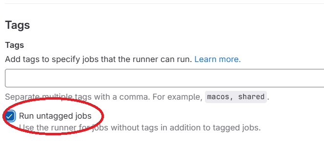
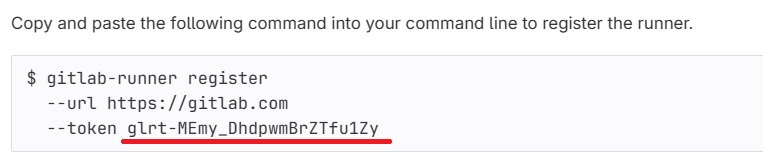
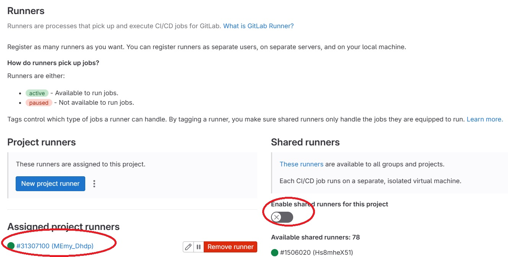
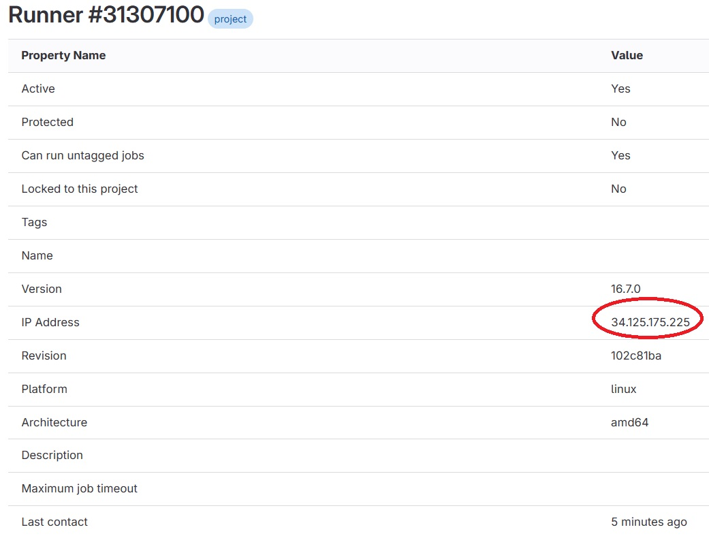

# gitlab을 이용한 CI/CD
작성한 문서가 한번 날라갔다. 행복하지 않다. github는 왜 자동저장이 안되는걸까...<br>

CI는 Continuous Integeration, CD는 Continuous Development를 의미한다.<br>
개발된 소스를 편하게 통합하고, 편하게 배포하자는 것이다.<br>
물론, 버전관리와 품질관리도 포함하는 의미이다.<br>
gitlab의 CI/CD 기능을 살펴보자. <br>

## 들어가면서
김또비는 it 회사에 시스템 엔지니어로 입사했다. 이 회사는 한달에 한번 배포한다.<br>
오늘은 한달동안 열심히 개발한 소스코드를 운영서버에 적용하는 날이다.<br>
개발자와 서버 담당자 모두가 야근을 해야 한다.<br>
개발서버에서 잘 돌아가던 소스코드도 운영서버에서 버그가 생길수 있기 때문이다.<br>

입사한지 육개월이 지났다. 서비스가 엄청 늘어났다.<br>
서비스가 커지면서 수시로 배포를 해야하는 경우가 생겼다.<br>
한달에 한번 야근하던 김또비는 이제 매일 야근을 해야한다.<br>
지옥문이 열린다.<br>
퇴사한다.<br>

CI/CD를 이용하면 이런 비참한 현실을 막을 수 있다.<br>

## 환경
google cloud platform E2 server(Debian GNU/Linux 11 (bullseye))

## gitlab CI/CD 작동 원리
1. gitlab 프로젝트에서 소스코드를 수정 후 commit을 한다.
2. gitlab에서 runner에게 "배포를 해버렷!" 지시한다.<br>
   이 때, 1번을 생략하고 수동으로 배포할 수 있다.<br>
   배포 서버에는 runner가 프로세스 형태로 동작하고 있다.<br>
   배포를 해버렷! 지시를 하면 gitlab에서 배포서버의 runner에게 https 프로토콜을 이용하여 지시를 한다.<br>
   runner의 default 포트는 443이다. <br>
   다른 프로세스(apache, nginx, etc)가 443을 사용하면 포트를 변경해야 한다.    
4. runner는 배포서버에서 .gitlab-ci.yml에 정의된 동작을 시행한다. <br>
   .gitlab-ci.yml은 gitlab 프로젝트 최상위 폴더에 위치한다.<br>
   이 파일에는 빌드, 테스트, 배포 명령어가 명시되어있다. 

## 이 포스트에서 하는일
1. gitlab 프로젝트를 생성한다.
2. 배포서버에 runner를 설치한다.
3. .gitlab-ci.yml 파일을 작성한다.
4. 실제 배포를 하면서 변화를 관찰한다.

# gitlab 프로젝트 생성

1. gitlab에서 "new project"를 클릭하여 새로운 프로젝트 생성
2. "create blank project" 클릭
3. project name 입력하고 "create project" 클릭
4. 해당 프로젝트에 소스코드 업로드

# 배포서버 runner 설치
https://docs.gitlab.com/runner/install/linux-repository.html 를 참조하여 작성하였다.


# gitlab에서 runner 등록(register)<br>
   runner는 소스코드가 배포될 서버에서 동작한다. gitlab에서 배포 명령을 받으면 사용자가 정의한 명령어를 실행하는 역할을 한다.<br>
   
   ### 먼저 runner 등록을 위한 정보가 필요하다. gitlab에서 생성한 프로젝트를 클릭해보자.
   

   ### 좌측 "setting"에 마우스 오버 후 "CI/CD"를 클릭한다.

   

   ### runner 우측의 "expand" 클릭 후 "new project runner" 를 클릭한다.

   

   ### 다른 설정은 그대로 두고 tag 이름을 입력한다. "run untagged jobs" 항목을 클릭하면 tag를 생략할 수 있다.<br>

   ### 이 포스트에서는 tag를 생략하겠다. 이후 "create runner"를 클릭한다.

   

   ### 생성된 token 값을 메모장에 복사해 놓는다. 서버에서 runner를 등록할 때 필요하다. <br>

# 서버에 gitlab repository 추가
   서버에 runner를 설치하기 위해 repository를 등록한다. 
```
curl -L "https://packages.gitlab.com/install/repositories/runner/gitlab-runner/script.deb.sh" | sudo bash
```
# 서버에 gitlab runner install
```
sudo apt-get install gitlab-runner
```
# runner 등록
```
sudo gitlab-runner register
```
아래와 같은 창이 뜨면 "https://gitlab.com/"을 입력한다. 
```
Enter the GitLab instance URL (for example, https://gitlab.com/):
```
token 값을 입력하라고 뜬다. 메모장에 복사해놓은 token 값을 입력한다. 
```
Enter the registration token:
```
runner의 name을 입력한다. 이름은 크게 상관 없다.
```
Enter a name for the runner. This is stored only in the local config.toml file
```
excutor의 종류를 입력한다. shell을 입력하면 된다.
```
Enter an executor: custom, docker, docker-windows, ssh, kubernetes, parallels, shell, virtualbox, docker-autoscaler, docker+machine, instance:
```

# 이제 runner가 등록되었다. <br>

### 다시 프로젝트 - setting -ci/cd - runner로 들어가면 새로운 runner가 등록된것을 볼 수 있다.<br>
### 여기서 "Enable shared runners for this project"를 비활성화한다.


### runner를 클릭하면 runner가 동작하는 서버의 ip주소를 확인할 수 있다. 


